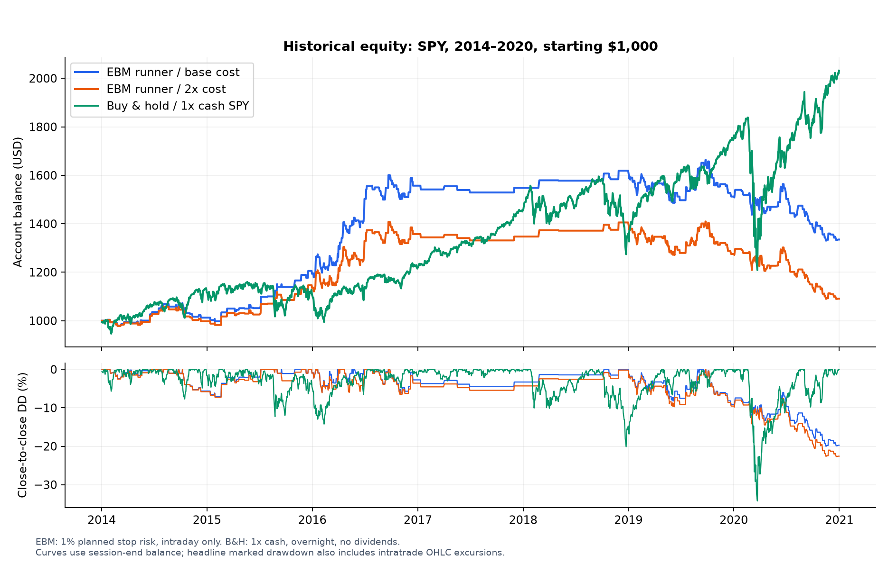
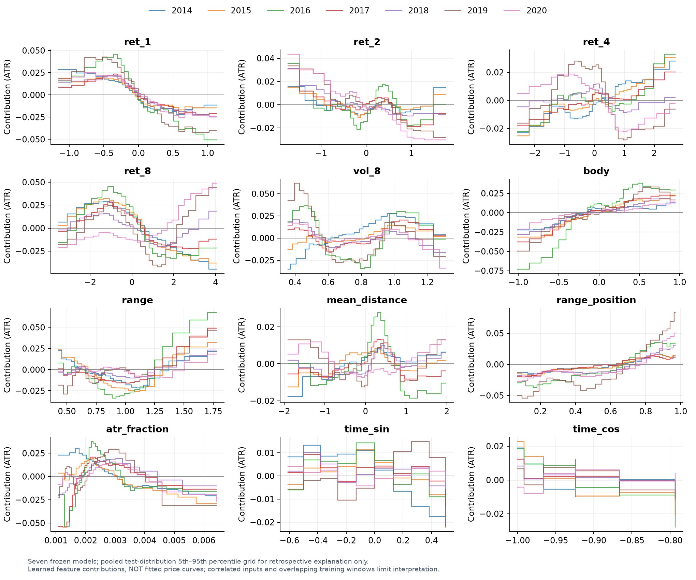
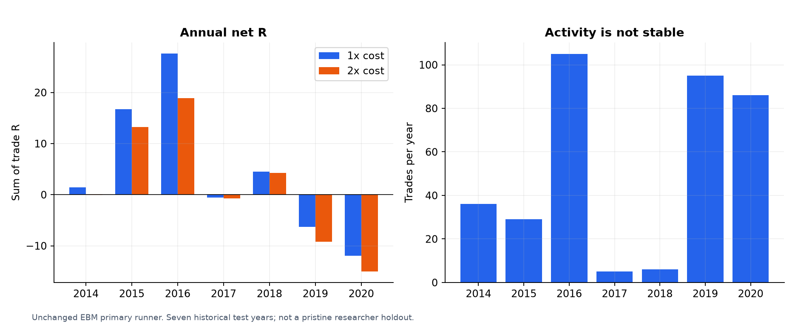
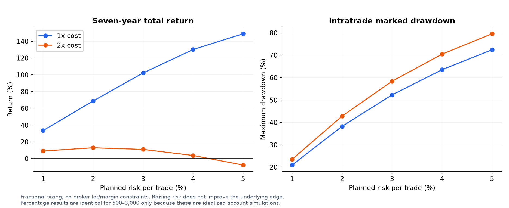
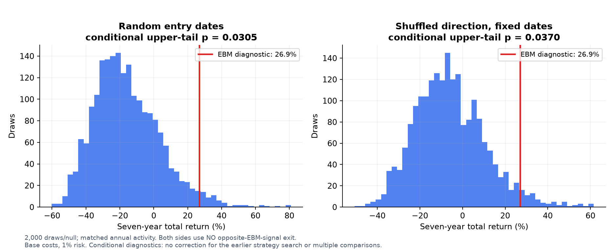
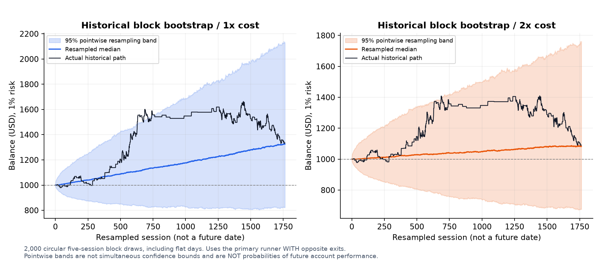
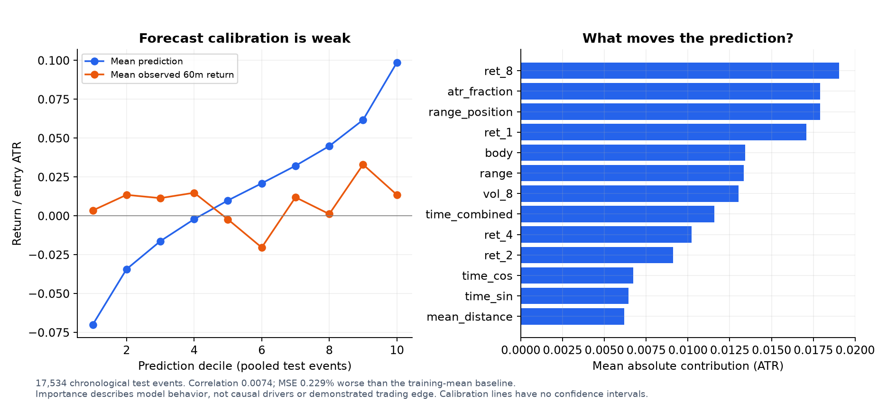

# EBM Trading Audit

Audit **Explainable Boosting Machine (EBM)** untuk strategi intraday SP500:
bagaimana model bekerja, apa yang dipelajari, apakah backtest menghasilkan
profit setelah biaya, dan apakah entry-nya lebih informatif daripada kontrol acak.

> **Status: HISTORICALLY_POSITIVE · EDGE_UNCONFIRMED · NOT_EA_READY.**
> Hasil di sini menggunakan **SPY ETF sebagai proxy**, bukan feed Exness US500.
> Belum ada EA, validasi broker, atau demo-forward. XAUUSD belum diuji di repo ini.

Repo ini memisahkan kandidat EBM dari proyek Lorentzian. Gaya audit mengikuti
[Lorentzian Classifier Audit](https://github.com/AfdulRohmat/lorentzian-classifier-audit),
tetapi model, data, periode dan hasilnya tidak boleh dianggap identik.
Tidak ada tuning atau training ulang ketika repo ini dibuat.

## Ringkasan: apa yang berhasil dan apa yang belum?

EBM memberi estimasi gerak harga 60 menit ke depan. Hanya prediksi yang cukup
besar untuk melewati biaya dan buffer yang boleh menjadi entry. Strategi lalu
mengelola posisi dengan stop dan trailing; **model prediksi bukan keseluruhan
strategi trading**.

Pada 362 trade selama 2014–2020, runner EBM menghasilkan profit historis.
Pengujian kontrol baru juga memberi indikasi bahwa pemilihan entry/arah tidak
sekadar setara random. Namun prediksi return keseluruhan hampir tidak berkorelasi
dengan kenyataan, hasil tahunan tidak stabil, interval ketidakpastian mencakup
kerugian, dan modal broker belum dimodelkan secara realistis.

| Simulasi | Total return, 7 tahun | Akhir dari $1.000 | Max marked DD | PF |
|---|---:|---:|---:|---:|
| EBM primary runner, risk 1%, biaya dasar | +33,50% | $1.334,96 | 20,97% | 1,188 |
| EBM primary runner, risk 1%, biaya 2× | +9,10% | $1.090,99 | 23,51% | 1,064 |
| Buy & hold SPY, cash-funded 1×, biaya dasar | +103,18% | $2.031,82 | 35,63% | Tidak relevan |

Sumber: [accounts.csv](results/accounts.csv),
[historical_summary.csv](results/historical_summary.csv),
[buy_hold_accounts.csv](results/buy_hold_accounts.csv).
Return di tabel **kumulatif, bukan per tahun**. CAGR EBM dasar 4,21%; B&H 10,66%.
Marked DD memakai lintasan OHLC intramenit yang dimodelkan, bukan rekaman tick.



**Bukan perbandingan risk-equivalent:** EBM hanya intraday, sedangkan B&H memegang
SPY overnight. B&H tidak memakai leverage; EBM menggunakan sizing berdasarkan
jarak stop dan bisa membutuhkan leverage tinggi. B&H tidak memasukkan dividen,
pajak, atau biaya pendanaan; hasil ini bukan total-return benchmark resmi.
Kurva di atas memakai saldo akhir sesi, sehingga DD pada kurva dapat lebih kecil
daripada headline DD yang memasukkan pergerakan selama trade.

## 1. EBM itu apa, dalam bahasa trading?

EBM adalah **Explainable Boosting Machine**. Dalam implementasi kita, model
regresi belajar tabel kontribusi untuk masing-masing fitur:

```text
prediksi gerak 60 menit / ATR
    = intercept
    + kontribusi momentum pendek
    + kontribusi bentuk candle
    + kontribusi volatilitas
    + kontribusi posisi dalam range
    + kontribusi waktu sesi
```

Secara tepat ada 12 fitur, bukan lima skor kelompok di atas. Setiap fitur masuk
ke bin; model membaca kontribusinya, lalu menjumlahkan semuanya. `interactions=0`
berarti tidak ada fungsi interaksi pasangan fitur di kandidat ini. EBM berasal
dari keluarga generalized additive models yang dilatih dengan boosting; lihat
[dokumentasi InterpretML](https://interpret.ml/docs/ebm.html) dan
[paper InterpretML](https://arxiv.org/abs/1909.09223).

Contoh **ilustratif, bukan trade hasil audit**: prediksi `+0,12 ATR`, biaya
round-trip `0,04 ATR`, buffer `0,05 ATR` → cukup besar untuk buy. Prediksi `+0,06`
dengan biaya yang sama → tidak entry. Nilai `0,12` **bukan probabilitas menang
12%**, bukan target profit akun, dan bukan kepastian harga akan naik.

Tidak seperti Lorentzian KNN/ANN, EBM tidak mencari tetangga terdekat saat
inference. Keduanya memakai fitur yang dirancang lebih dulu, tetapi cara
belajarnya berbeda. Algoritma EBM berbasis riset; **pilihan fitur, target,
threshold, dan runner trading di sini adalah eksperimen kita**, bukan strategi
SP500 yang sudah dibuktikan profitable oleh paper tersebut.

Kode: [model.py](src/ebm_audit/model.py),
[tujuh model portable](models/), [feature extraction](src/ebm_audit/data.py).

## 2. Feature extraction: apa yang dilihat model?

Input berasal dari candle Bid **M30 yang sudah selesai**, dibentuk dari tepat
30 candle M1. Tidak ada forward-fill untuk candle hilang. ATR adalah **SMA14
true range**, bukan Wilder RMA; ini penting jika nanti dipindah ke EA.

| Fitur | Definisi / makna |
|---|---|
| `ret_1`, `ret_2`, `ret_4`, `ret_8` | Selisih close terhadap 1/2/4/8 bar sebelumnya, dibagi ATR |
| `vol_8` | Standar deviasi delapan perubahan close, dibagi ATR |
| `body` | `(close − open) / ATR` |
| `range` | `(high − low) / ATR` |
| `mean_distance` | `(close − SMA8(close)) / ATR` |
| `range_position` | Posisi close dalam rentang low–high delapan bar |
| `atr_fraction` | `ATR / close` |
| `time_sin`, `time_cos` | Encoding siklik menit dalam hari New York |

Lag berarti bar trading yang tersedia, **bukan jam kalender kontinu**. Bar
sebelumnya dapat berasal dari sesi sebelumnya: `ret_1` di awal hari juga bisa
mengandung gap overnight. Volume/VWAP, RSI dan ADX **tidak digunakan** kandidat ini.

### Kurva yang dipelajari, bukan “curve fit harga”



Garis berlabel tahun **pengujian**: model 2014 dilatih sebelum 2014, bukan pada
hasil 2014. Sumbu X menggunakan grid p05–p95 gabungan data uji untuk penjelasan
retrospektif saja; tidak digunakan untuk memilih entry. Sumbu Y adalah kontribusi
ke prediksi, dalam ATR, **bukan realized return**.

Ada kecenderungan `ret_1` menyerupai reversal, sementara `body` dan
`range_position` menyerupai continuation. Sebagian bentuk lain berubah antar-model.
Fitur saling berkorelasi dan jendela train tahunan saling beririsan: kontribusi
tidak membuktikan sebab-akibat, dan tujuh garis bukan tujuh eksperimen independen.
Kurva yang terlihat masuk akal tidak menyingkirkan overfitting.

## 3. Data, target, dan walk-forward

- Sumber: [Kaggle SP500 intraday archive, versi 1](https://www.kaggle.com/datasets/gratefuldata/intraday-stock-data-1-min-sp-500-200821/versions/1), hanya SPY.
- Data persiapan: 2009–2020, **1.173.367** bar M1 regular trading hours.
- Evaluasi: 2014–2020, **1.763 sesi**, **17.534** event prediksi, **362** entry.
- Kalender XNYS, termasuk hari libur dan early close. Decision grid M30 yang
  tersedia dari 10:00 sampai 14:30 New York.
- Timezone sumber diasumsikan `America/Denver`, bukan dikonfirmasi provider.
  Harga tunggal dijadikan midpoint; bid/ask adalah sintetis, bukan quote broker.
- Ada 143 menit kalender yang hilang pada keseluruhan data persiapan.
  Semua 17.534 event uji yang dipakai audit memiliki lintasan entry–session-close lengkap.
- Target: `(midpoint open pada t+60m − midpoint open pada t) / ATR_t`, sebelum biaya.

| Tahun uji | Train untuk memilih model | Validasi | Refit final sebelum test |
|---|---|---|---|
| 2014 | 2009–2012 | 2013 | 2009–2013 |
| 2015 | 2010–2013 | 2014 | 2010–2014 |
| 2016 | 2011–2014 | 2015 | 2011–2015 |
| 2017 | 2012–2015 | 2016 | 2012–2016 |
| 2018 | 2013–2016 | 2017 | 2013–2017 |
| 2019 | 2014–2017 | 2018 | 2014–2018 |
| 2020 | 2015–2018 | 2019 | 2015–2019 |

Training memakai `ExplainableBoostingRegressor`: `interactions=0`, `max_bins=32`,
`outer_bags=1`, `inner_bags=0`, `validation_size=0`, `learning_rate=0.04`,
`greedy_ratio=0`, seed `260926`. Pilih `max_rounds` dari `[200, 500]` menggunakan
MSE validasi, lalu refit lima tahun sebelum test. Tidak ada random train/test split.

**Batas OOS:** tiap tahun berada di luar fitting model tahun tersebut, tetapi
periode ini sudah pernah dianalisis peneliti. Exit runner juga merupakan ablation
setelah hasil sebelumnya dilihat. Ini **model-OOS historis**, bukan pristine
researcher holdout. Seed kontrol baru ditetapkan sebelum kontrol dihitung,
tetapi tidak menghapus bias dari rangkaian riset sebelumnya.

## 4. Aturan entry, exit, biaya, dan account sizing

1. Hitung fitur setelah M30 selesai; entry pada M1 open berikutnya (timestamp
   penutupan bar M30), bukan memakai close yang belum diketahui.
2. Buy jika prediksi `> biaya_round_trip/ATR + 0,05`; sell jika di bawah negatif
   ambang tersebut. Ambil **entry pertama yang memenuhi syarat, maksimum satu/hari**.
3. Primary runner: initial stop **1 ATR** dari harga fill, **tanpa fixed TP**.
4. Pada completed M30 close, setelah keuntungan liquidation mencapai **+1 net R**,
   trailing mengunci `best completed-close R − 1R`. Stop baru berlaku dari M1
   berikutnya; intrabar high belum cukup untuk mengaktifkan trailing.
5. Exit karena stop, sinyal EBM berlawanan yang eligible, atau session close.
   Tidak menahan posisi overnight. Gap stop diproses sebelum market exit pada open.
6. Dua pembanding exit lama tetap ditampilkan: exit 60 menit dengan stop 2 ATR
   dan exit 60 menit dengan stop 1 ATR. **Fixed60 berarti waktu exit, bukan fixed TP.**

Biaya dasar: synthetic spread **1 bps**, slippage **0,25 bps per sisi**,
commission nol. Stress 2× menggandakan spread dan slippage, tetapi memakai entry,
arah dan jadwal opposite signal yang sama. Harga fill executable bid/ask,
slippage dan biaya dihitung di PnL; bukan pengurangan persentase profit belakangan.

`R` memakai risiko stop yang direncanakan termasuk exit slippage/commission.
Ukuran posisi = `balance × risk_fraction / risk_points`. Initial stop tanpa gap
setara −1R; gap dapat lebih buruk. Semua simulasi memakai **fractional units**,
belum minimum lot, lot step, margin, broker stop level, rejection, latency atau swap.

| Exit | Net R dasar | PF dasar | Net R biaya 2× | PF biaya 2× |
|---|---:|---:|---:|---:|
| Fixed60, stop 2 ATR | +5,33 | 1,097 | −2,89 | 0,951 |
| Fixed60, stop 1 ATR | +14,48 | 1,138 | −2,21 | 0,980 |
| Primary runner, stop 1 ATR | +31,68 | 1,188 | +11,40 | 1,064 |

Runner belajar dari target **60 menit**, tetapi dapat memegang posisi lebih lama.
Profitabilitas runner tidak otomatis berarti prediksi targetnya akurat.

## 5. Konsistensi hasil dan risiko akun



Primary runner: win rate **47,51%**, rata-rata **+0,0875R/trade**, maksimum losing
streak **9**, sekitar **0,99 trade/minggu**. Hanya **4/7 tahun** positif pada biaya
dasar, **3/7** pada biaya 2×. Aktivitas juga tidak stabil: 2016 memiliki 105 trade,
2017 hanya 5, 2018 hanya 6. Ini belum memenuhi aspirasi 3–5 trade/minggu.

Winner penting: setelah menghapus dua trade terbaik masih +22,73R, setelah
menghapus lima +11,39R, tetapi setelah sepuluh menjadi **−6,37R**. Hasil long
dan short tidak dijadikan alasan untuk menghapus salah satu arah setelah melihat hasil.



| Risk/trade | Return dasar | DD dasar | Return biaya 2× | DD biaya 2× |
|---|---:|---:|---:|---:|
| 1% | +33,50% | 20,97% | +9,10% | 23,51% |
| 2% | +68,73% | 38,24% | +12,90% | 42,81% |
| 3% | +102,22% | 52,28% | +10,97% | 58,38% |
| 4% | +130,13% | 63,53% | +3,72% | 70,48% |
| 5% | +148,99% | 72,43% | −7,70% | 79,58% |

Grid lengkap mencakup modal **$500, $1.000, $1.500, $2.000, $2.500, $3.000**:
[accounts.csv](results/accounts.csv). Return/DD persentase sama antar-modal
hanya karena fractional sizing ideal. Pada risk 1%, notional leverage maksimum
bahkan mencapai **10,36×**; pada 5% sekitar **51,80×**. Karena itu hasil $500
bukan bukti bahwa akun Raw $500 dapat mengeksekusi semua trade tersebut.
Tidak ada batas DD pribadi yang dipaksakan atau risk “terbaik” yang dipilih.

## 6. EBM versus random entry: perbandingan yang dipadankan

Pertanyaan: jika jumlah trade, komposisi long/short dan jam entry tahunan sama,
apakah pemilihan entry EBM memberi hasil yang lebih baik daripada pengacakan?

- **Random direction:** tanggal/jam entry EBM tetap; arah dipermutasi dalam tahun
  yang sama sambil mempertahankan jumlah long dan short.
- **Random entry:** pasangan jam/arah dipindah ke tanggal eligible acak dalam
  tahun yang sama, tanpa lebih dari satu trade/hari. Penolakan sampel hanya karena
  ketersediaan data, bukan hasil profit/loss.
- **2.000 draw per kontrol**, seed `261004`, semua tiga exit × dua biaya × lima
  risk × enam modal. Tidak memilih seed atau draw yang terlihat bagus.

**Penting:** random trader tidak memiliki sinyal opposite EBM. Maka perbandingan
utama kontrol memakai runner **tanpa opposite-signal exit pada kedua sisi**.
Hasil diagnostic EBM ini +26,93%, berbeda dari primary runner +33,50%; keduanya
dilaporkan, tidak ditukar diam-diam.



Runner diagnostic, biaya dasar, risk 1%:

| Kandidat/kontrol | Return atau median | Rentang draw 2,5–97,5% | Conditional upper-tail p |
|---|---:|---:|---:|
| EBM, no-opposite diagnostic | +26,93% | Satu lintasan historis | — |
| Random entry | −18,23% | −47,13% hingga +29,70% | 0,0305 |
| Random direction | −7,28% | −33,91% hingga +31,01% | 0,0370 |

EBM sekitar persentil **97,00** terhadap random entry dan **96,35** terhadap random
direction. Ada indikasi informatif, **bukan konfirmasi profit live**. P dihitung
`(1 + jumlah draw ≥ hasil EBM)/(1 + 2000)`; ini bukan probabilitas model benar.
Tabel semua arm: [random_comparison.csv](results/random_comparison.csv) dan
[distribusi semua akun](results/random_account_distributions.csv).

Kontrol dikondisikan pada aktivitas EBM yang sudah terjadi; bukan strategi acak
yang bisa dieksekusi prospektif dengan mengetahui jumlah entry setahun di muka.
Tidak ada koreksi untuk seluruh pencarian strategi sebelumnya atau semua
perbandingan sekunder. Melewati kontrol bukan otomatis lulus promotion gate.

## 7. Monte Carlo: seberapa rapuh hasil historis?



Di sini Monte Carlo adalah **circular moving-block bootstrap**: 2.000 simulasi,
blok lima sesi, seed `261005`, panjang tetap 1.763 sesi, termasuk hari tanpa
trade. Lintasan net R/intratrade ikut disampling, lalu saldo dan drawdown dihitung
dengan compounded risk. Ini memakai **primary runner**, termasuk opposite exits.

Pada risk 1%, biaya dasar, dari $1.000:

- Median akhir **$1.325,71**; interval persentil 95% **$822,14–$2.126,20**.
- Rentang return **−17,79% sampai +112,62%**: kerugian belum dapat disingkirkan.
- Median marked DD **17,11%**; rentang persentil 95% **10,01%–33,37%**.

Angka 87,9% resample positif adalah frekuensi di eksperimen resampling ini,
**bukan peluang 87,9% kita profit di masa depan**. Bootstrap mengasumsikan blok
historis cukup representatif; tidak mengulang training, tidak memodelkan regime
baru atau biaya broker aktual, dan tidak memperbaiki bias pemilihan strategi.
Band pada grafik bersifat pointwise, bukan batas simultan seluruh lintasan.

Hasil semua modal/risk: [biaya dasar](results/bootstrap_cost1/bootstrap_accounts.csv)
dan [biaya 2×](results/bootstrap_cost2/bootstrap_accounts.csv).
Bootstrap expectancy lama juga melintasi nol: **[−0,0387; +0,2216]R/trade**.
Ini berbeda dari conditional-null test: keduanya menjawab pertanyaan berbeda.

## 8. Apakah model benar-benar pandai memprediksi?



Pada semua 17.534 event uji, bukan hanya trade yang dipilih:

| Ukuran | Hasil |
|---|---:|
| Korelasi prediksi dengan realized target | 0,00737 |
| MSE EBM | 0,684964 |
| MSE baseline rata-rata data belajar | 0,683397 |
| Perubahan MSE terhadap baseline | **0,229% lebih buruk** |

[Forecast metrics per tahun](results/forecast_metrics.csv). Keuntungan strategi
di subset entry dengan payoff runner **tidak membatalkan** lemahnya kualitas
regresi secara keseluruhan. Sebaliknya, MSE lemah tidak sendirian membuktikan
bahwa setiap subset sinyal tidak berguna. Kita membutuhkan keduanya: audit model
dan audit strategi, lalu bukti baru di luar data yang sudah dilihat.

## 9. Reproduksi dan isi repository

```text
config/audit.json             kontrak exit, biaya, modal, risk, seed
models/fold1..fold7/          model EBM portable, tanpa raw market data
src/ebm_audit/                inference, fitur, eksekusi, kontrol, bootstrap
scripts/run_audit.py          replay penuh dari arsip lokal yang hash-verified
scripts/generate_figures.py   semua grafik dari evidence yang di-commit
results/                     trade/account tables dan hasil kontrol
docs/                        tech plan, metodologi, provenance, grafik
tests/                       causal execution, parity, sizing, sampling
```

Python 3.11+; replay ini dijalankan dengan Python 3.12. Dari root repo:

```bash
python -m venv .venv
source .venv/bin/activate
python -m pip install -r requirements-audit.txt
python -m pip install --no-deps -e .
python -m pytest -q
python scripts/generate_figures.py
```

Pada Windows gunakan `.venv\Scripts\activate`. Inference portable dan regenerasi
grafik tidak memerlukan C++; full replay memerlukan compiler C++17 (macOS/Linux
didukung script saat ini). Lihat [REPRODUCIBILITY.md](docs/REPRODUCIBILITY.md)
untuk batas reproduksi dan cara menyediakan arsip input. **Clone saja cukup
untuk membuat ulang grafik, belum cukup untuk replay pasar atau retraining.**

Audit ini merekonstruksi 17.534 prediksi dengan error maksimum **0**, mencocokkan
seluruh trade dan grid akun primary dengan v3, menguji parity Python/C++ untuk
semua lintasan kandidat dan 252 lintasan cache kontrol, serta mempertahankan
**253 file sumber** tanpa perubahan. Detail: [audit.json](results/audit.json),
[checksum evidence](results/checksums.json), [tech plan](docs/TECHNICAL_PLAN.md).
Tes sintetik tidak menggantikan pengujian broker atau live capture.

## 10. Keputusan dan langkah menuju EA

**Belum EA-ready.** Bukan karena backtest seluruhnya gagal, tetapi karena belum
cukup bukti bahwa hasil ini stabil, terjangkau dan dapat dieksekusi di broker.
Langkah berikutnya bukan mengejar parameter yang lebih cantik:

1. Bekukan kandidat beserta exit utama; jangan memilih risk berdasarkan return tertinggi.
2. Validasi rule yang sama pada feed US500 broker, dengan spread, lot, margin,
   stop constraints dan session yang benar. Jangan menganggap SPY = CFD.
3. Tentukan protokol periode evaluasi baru yang benar-benar belum dipakai memilih
   strategi. Jangan mengganti label periode lama menjadi holdout baru.
4. Bila tetap layak, bangun EA dan uji parity closed-bar, ATR, bin boundary,
   restart/recovery, sizing dan fill. Baru demo-forward berbasis jumlah trade.

Tidak ada rekomendasi live money dalam repo ini. Tidak ada raw archive Kaggle,
token, atau kredensial yang didistribusikan. Hak penggunaan data tetap mengikuti
penyedianya. Tidak ada lisensi open-source baru yang diasumsikan untuk kode milik
pemilik repo; lisensi dependensi berlaku terpisah.

### Referensi

- [InterpretML — EBM](https://interpret.ml/docs/ebm.html): mekanisme additive boosting dan interpretabilitas.
- [Nori et al. (2019), InterpretML](https://arxiv.org/abs/1909.09223): framework, bukan bukti profit trading.
- [Lou et al. (2013), Accurate Intelligible Models with Pairwise Interactions](https://www.microsoft.com/en-us/research/wp-content/uploads/2017/06/kdd13.pdf): keluarga model; kandidat ini mematikan interaksi.
- [Bailey et al., The Probability of Backtest Overfitting](https://www.davidhbailey.com/dhbpapers/backtest-prob.pdf): risiko seleksi backtest; repo ini tidak mengklaim telah menghitung PBO formal.

Semua angka kinerja berasal dari evidence lokal yang disertakan, bukan dari paper referensi.
